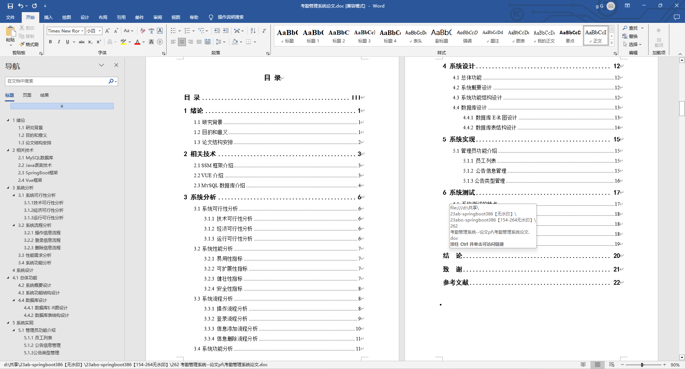

基于Springboot的考勤管理系统（程序+论文）
=
### 完整代码获取地址：从戎源码网 ([https://armycodes.com/](https://armycodes.com/))
### 作者微信：19941326836  QQ：952045282 
### 承接计算机毕业设计、Java毕业设计、Python毕业设计、深度学习、机器学习
### 选题+开题报告+任务书+程序定制+安装调试+论文+答辩ppt 一条龙服务
### 所有选题地址https://github.com/nature924/allProject

一、项目介绍
---
基于Spring Boot框架实现的考勤管理系统，系统包含两种角色：员工、管理员主要功能如下。

### 【员工功能】

1. **首页：** 显示员工个人信息。
2. **个人中心：**
   - **修改密码：** 修改员工账户的登录密码。
   - **个人信息：** 查看和编辑个人基本信息。
3. **员工请假管理：** 提交请假申请。
4. **员工出差管理：** 提交出差申请。
5. **薪资管理：** 查看个人薪资信息。
6. **员工签到管理：** 进行每日签到。
7. **公告管理：** 查看公司发布的通知公告。

### 【管理员功能】

1. **首页：** 显示系统的整体概。
2. **个人中心：**
   - **修改密码：** 修改管理员账户的登录密码。
   - **个人信息：** 查看和编辑管理员的基本信息。
3. **员工管理：** 管理公司的员工信息，。
4. **员工请假管理：** 查看员工请假申请。
5. **员工出差管理：** 查看员工出差申请。
6. **薪资管理：** 查看员工的薪资信息。
7. **员工签到管理：** 查看员工的签到记录。
8. **档案管理：** 管理员工的档案信息。
9. **公告管理：** 发布和管理通知公告，。
10. **菜单管理：** 管理系统的菜单。
11. **基础数据管理：**
    - **部门管理：** 维护公司部门的信息。
    - **公告类型管理：** 维护通知公告的分类。
    - **出差类型管理：** 管理出差申请的分类。
    - **交通工具管理：** 维护公司提供的交通工具信息。
    - **请假类型管理：** 管理请假申请的分类。

二、项目技术
---
- 编程语言：Java
- 数据库：MySQL
- 项目管理工具：Maven
- 前端技术：VUE、HTML、Jquery、Bootstrap
- 后端技术：Spring、SpringMVC、MyBatis

三、运行环境
---
- 操作系统：Windows、macOS都可以
- JDK版本：JDK1.8以上都可以
- 开发工具：IDEA、Ecplise、Myecplise都可以
- 数据库: MySQL5.7以上都可以
- Tomcat：任意版本都可以
- Maven：任意版本都可以

四、运行截图
---
### 论文截图：

### 程序截图：

